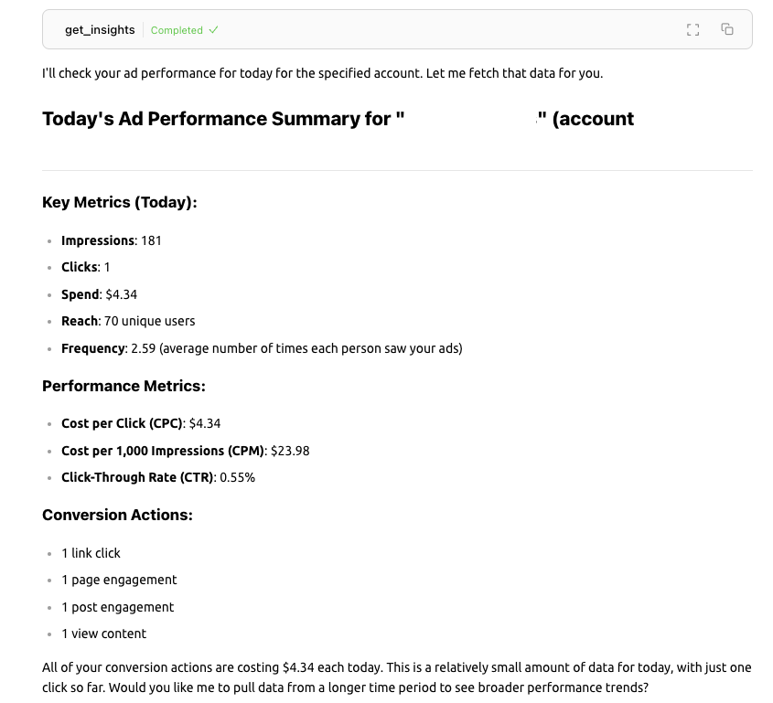

# Meta Ads MCP

A [Model Context Protocol (MCP)](https://modelcontextprotocol.io/) server for interacting with Meta Ads API. This tool enables AI models to access, analyze, and manage Meta advertising campaigns through a standardized interface, allowing LLMs to retrieve performance data, visualize ad creatives, and provide strategic insights for Facebook, Instagram, and other Meta platforms.

> **DISCLAIMER:** This is an unofficial third-party tool and is not associated with, endorsed by, or affiliated with Meta in any way. This project is maintained independently and uses Meta's public APIs according to their terms of service. Meta, Facebook, Instagram, and other Meta brand names are trademarks of their respective owners.

<a href="https://glama.ai/mcp/servers/@pipeboard-co/meta-ads-mcp">
  
</a>

Screenshot: using an LLM to understand your ad performance.



## Features

- **AI-Powered Campaign Analysis**: Let your favorite LLM analyze your campaigns and provide actionable insights on performance
- **Strategic Recommendations**: Receive data-backed suggestions for optimizing ad spend, targeting, and creative content
- **Automated Monitoring**: Ask any MCP-compatible LLM to track performance metrics and alert you about significant changes
- **Budget Optimization**: Get recommendations for reallocating budget to better-performing ad sets
- **Creative Improvement**: Receive feedback on ad copy, imagery, and calls-to-action
- **Campaign Management**: Request changes to campaigns, ad sets, and ads (all changes require explicit confirmation)
- **Cross-Platform Integration**: Works with Facebook, Instagram, and all Meta ad platforms
- **Universal LLM Support**: Compatible with any MCP client including Claude Desktop, Cursor, Cherry Studio, and more
- **Simple Authentication**: Easy setup with secure OAuth authentication
- **Cross-Platform Support**: Works on Windows, macOS, and Linux

## Installation

### Using uv (recommended)

When using uv no specific installation is needed. We can use uvx to directly run meta-ads-mcp:

```bash
# Run with Meta authentication
uvx meta-ads-mcp --app-id YOUR_META_ADS_APP_ID
```

If you want to install the package:

```bash
uv pip install meta-ads-mcp
```

For development (if you've cloned the repository):

```bash
# From the repository root
uv pip install -e .
```

### Using pip

Alternatively, you can install meta-ads-mcp via pip:

```bash
pip install meta-ads-mcp
```

After installation, you can run it as:

```bash
# Run with Meta authentication
python -m meta_ads_mcp --app-id YOUR_META_ADS_APP_ID
```

## Configuration

### Create a Meta Developer App (Required)

Before using the MCP server, you'll need to set up a Meta Developer App:

1. Go to [Meta for Developers](https://developers.facebook.com/) and create a new app
2. Choose the "Consumer" app type
3. In your app settings, add the "Marketing API" product
4. Configure your app's OAuth redirect URI to include `http://localhost:8888/callback`
5. Note your App ID (Client ID) for use with the MCP

### Usage with Cursor or Claude Desktop

Add this to your `claude_desktop_config.json` to integrate with Claude or `~/.cursor/mcp.json` to integrate with Cursor:

```json
"mcpServers": {
  "meta-ads": {
    "command": "uvx",
    "args": ["meta-ads-mcp", "--app-id", "YOUR_META_ADS_APP_ID"]
  }
}
```

### Available MCP Tools

1. `mcp_meta_ads_get_ad_accounts`
   - Get ad accounts accessible by a user
   - Inputs:
     - `access_token` (optional): Meta API access token (will use cached token if not provided)
     - `user_id`: Meta user ID or "me" for the current user
     - `limit`: Maximum number of accounts to return (default: 10)
   - Returns: List of accessible ad accounts with their details

2. `mcp_meta_ads_get_account_info`
   - Get detailed information about a specific ad account
   - Inputs:
     - `access_token` (optional): Meta API access token (will use cached token if not provided)
     - `account_id`: Meta Ads account ID (format: act_XXXXXXXXX)
   - Returns: Detailed information about the specified account

3. `mcp_meta_ads_get_campaigns`
   - Get campaigns for a Meta Ads account with optional filtering
   - Inputs:
     - `access_token` (optional): Meta API access token (will use cached token if not provided)
     - `account_id`: Meta Ads account ID (format: act_XXXXXXXXX)
     - `limit`: Maximum number of campaigns to return (default: 10)
     - `status_filter`: Filter by status (empty for all, or 'ACTIVE', 'PAUSED', etc.)
   - Returns: List of campaigns matching the criteria

4. `mcp_meta_ads_get_campaign_details`
   - Get detailed information about a specific campaign
   - Inputs:
     - `access_token` (optional): Meta API access token (will use cached token if not provided)
     - `campaign_id`: Meta Ads campaign ID
   - Returns: Detailed information about the specified campaign

5. `mcp_meta_ads_create_campaign`
   - Create a new campaign in a Meta Ads account
   - Inputs:
     - `access_token` (optional): Meta API access token (will use cached token if not provided)
     - `account_id`: Meta Ads account ID (format: act_XXXXXXXXX)
     - `name`: Campaign name
     - `objective`: Campaign objective (AWARENESS, TRAFFIC, ENGAGEMENT, etc.)
     - `status`: Initial campaign status (default: PAUSED)
     - `special_ad_categories`: List of special ad categories if applicable
     - `daily_budget`: Daily budget in account currency (in cents)
     - `lifetime_budget`: Lifetime budget in account currency (in cents)
   - Returns: Confirmation with new campaign details

6. `mcp_meta_ads_get_adsets`
   - Get ad sets for a Meta Ads account with optional filtering by campaign
   - Inputs:
     - `access_token` (optional): Meta API access token (will use cached token if not provided)
     - `account_id`: Meta Ads account ID (format: act_XXXXXXXXX)
     - `limit`: Maximum number of ad sets to return (default: 10)
     - `campaign_id`: Optional campaign ID to filter by
   - Returns: List of ad sets matching the criteria

7. `mcp_meta_ads_get_adset_details`
   - Get detailed information about a specific ad set
   - Inputs:
     - `access_token` (optional): Meta API access token (will use cached token if not provided)
     - `adset_id`: Meta Ads ad set ID
   - Returns: Detailed information about the specified ad set

8. `mcp_meta_ads_get_ads`
   - Get ads for a Meta Ads account with optional filtering
   - Inputs:
     - `access_token` (optional): Meta API access token (will use cached token if not provided)
     - `account_id`: Meta Ads account ID (format: act_XXXXXXXXX)
     - `limit`: Maximum number of ads to return (default: 10)
     - `campaign_id`: Optional campaign ID to filter by
     - `adset_id`: Optional ad set ID to filter by
   - Returns: List of ads matching the criteria

9. `mcp_meta_ads_get_ad_details`
   - Get detailed information about a specific ad
   - Inputs:
     - `access_token` (optional): Meta API access token (will use cached token if not provided)
     - `ad_id`: Meta Ads ad ID
   - Returns: Detailed information about the specified ad

10. `mcp_meta_ads_get_ad_creatives`
    - Get creative details for a specific ad
    - Inputs:
      - `access_token` (optional): Meta API access token (will use cached token if not provided)
      - `ad_id`: Meta Ads ad ID
    - Returns: Creative details including text, images, and URLs

11. `mcp_meta_ads_get_ad_image`
    - Get, download, and visualize a Meta ad image in one step
    - Inputs:
      - `access_token` (optional): Meta API access token (will use cached token if not provided)
      - `ad_id`: Meta Ads ad ID
    - Returns: The ad image ready for direct visual analysis

12. `mcp_meta_ads_update_ad`
    - Update an ad with new settings
    - Inputs:
      - `ad_id`: Meta Ads ad ID
      - `status`: Update ad status (ACTIVE, PAUSED, etc.)
      - `bid_amount`: Bid amount in account currency (in cents for USD)
      - `access_token` (optional): Meta API access token (will use cached token if not provided)
    - Returns: Confirmation with updated ad details and a confirmation link

13. `mcp_meta_ads_update_adset`
    - Update an ad set with new settings including frequency caps
    - Inputs:
      - `adset_id`: Meta Ads ad set ID
      - `frequency_control_specs`: List of frequency control specifications
      - `bid_strategy`: Bid strategy (e.g., 'LOWEST_COST_WITH_BID_CAP')
      - `bid_amount`: Bid amount in account currency (in cents for USD)
      - `status`: Update ad set status (ACTIVE, PAUSED, etc.)
      - `targeting`: Targeting specifications including targeting_automation
      - `access_token` (optional): Meta API access token (will use cached token if not provided)
    - Returns: Confirmation with updated ad set details and a confirmation link

14. `mcp_meta_ads_get_insights`
    - Get performance insights for a campaign, ad set, ad or account
    - Inputs:
      - `access_token` (optional): Meta API access token (will use cached token if not provided)
      - `object_id`: ID of the campaign, ad set, ad or account
      - `time_range`: Time range for insights (default: maximum)
      - `breakdown`: Optional breakdown dimension (e.g., age, gender, country)
      - `level`: Level of aggregation (ad, adset, campaign, account)
    - Returns: Performance metrics for the specified object

15. `mcp_meta_ads_debug_image_download`
    - Debug image download issues and report detailed diagnostics
    - Inputs:
      - `access_token` (optional): Meta API access token (will use cached token if not provided)
      - `url`: Direct image URL to test (optional)
      - `ad_id`: Meta Ads ad ID (optional, used if url is not provided)
    - Returns: Diagnostic information about image download attempts

16. `mcp_meta_ads_get_login_link`
    - Get a clickable login link for Meta Ads authentication
    - Inputs:
      - `access_token` (optional): Meta API access token (will use cached token if not provided)
    - Returns: A clickable resource link for Meta authentication

## Authentication

The Meta Ads MCP uses Meta's OAuth 2.0 authentication flow, designed for desktop apps:

When authenticating, it will:

1. Start a local callback server on your machine
2. Open a browser window to authenticate with Meta
3. Ask you to authorize the app
4. Redirect back to the local server to extract and store the token securely

This method requires you to [create a Meta Developer App](#create-a-meta-developer-app) as described above.

## Troubleshooting and Logging

The Meta Ads MCP includes a comprehensive logging system to help troubleshoot issues:

### Log Location

Log files are stored in a platform-specific location:

- **macOS**: `~/Library/Application Support/meta-ads-mcp/meta_ads_debug.log`
- **Windows**: `%APPDATA%\meta-ads-mcp\meta_ads_debug.log` 
- **Linux**: `~/.config/meta-ads-mcp/meta_ads_debug.log`

### Common Issues

#### Authentication Issues

If you encounter errors like `(#200) Provide valid app ID`, check the following:
- Ensure you've set up a Meta Developer App correctly
- Verify that you're passing the correct App ID using one of these methods:
  - Set the `META_APP_ID` environment variable: `export META_APP_ID=your_app_id`
  - Pass it as a command-line argument: `meta-ads-mcp --app-id your_app_id`

#### API Errors

If you receive errors from the Meta API:

1. Verify your app has the Marketing API product added
2. Ensure the user has appropriate permissions on the ad accounts
3. Check if there are rate limits or other restrictions on your app

### Debugging Command

For specific image download issues, use the built-in diagnostic tool:

```python
# Using direct tool call
mcp_meta_ads_debug_image_download(ad_id="your_ad_id")
```

This will give you detailed information about the download process and potential issues.

## Running with Different App IDs

If you need to use different Meta App IDs for different purposes:

```bash
# Using environment variable
export META_APP_ID=your_app_id
uvx meta-ads-mcp

# Or using command line argument
uvx meta-ads-mcp --app-id=your_app_id
```

## Privacy and Security

The Meta Ads MCP follows security best practices:

1. Tokens are cached in a platform-specific secure location:
   - Windows: `%APPDATA%\meta-ads-mcp\token_cache.json`
   - macOS: `~/Library/Application Support/meta-ads-mcp/token_cache.json`
   - Linux: `~/.config/meta-ads-mcp/token_cache.json`

2. You do not need to provide your access token for each command; it will be automatically retrieved from the cache.

3. You can set the `META_APP_ID` environment variable instead of passing it as an argument:
   ```bash
   export META_APP_ID=your_app_id
   uvx meta-ads-mcp
   ```

4. You can provide a direct access token using the `META_ACCESS_TOKEN` environment variable. This bypasses both the local token cache and the Pipeboard authentication method:
   ```bash
   export META_ACCESS_TOKEN=your_access_token
   uvx meta-ads-mcp
   ```
   This is useful for CI/CD pipelines or when you already have a valid access token from another source.

## Testing

### CLI Testing

Run the test script to verify authentication and basic functionality:

```bash
python test_meta_ads_auth.py --app-id YOUR_APP_ID
```

Use the `--force-login` flag to force a new authentication even if a cached token exists:

```bash
python test_meta_ads_auth.py --app-id YOUR_APP_ID --force-login
```

### LLM Interface Testing

When using the Meta Ads MCP with an LLM interface (like Claude):

1. Test authentication by calling the `mcp_meta_ads_get_login_link` tool
2. Verify account access by calling `mcp_meta_ads_get_ad_accounts`
3. Check specific account details with `mcp_meta_ads_get_account_info`

These functions will automatically handle authentication if needed and provide a clickable login link if required.

## Troubleshooting

### Authentication Issues

If you encounter authentication issues:

1. When using the LLM interface:
   - Use the `mcp_meta_ads_get_login_link` tool to generate a fresh authentication link
   - Ensure you click the link and complete the authorization flow in your browser
   - Check that the callback server is running properly (the tool will report this)

2. When using direct Meta OAuth:
   - Run with `--force-login` to get a fresh token: `uvx meta-ads-mcp --login --app-id YOUR_APP_ID --force-login`
   - Make sure the terminal has permissions to open a browser window

3. Skip authentication entirely by providing a token directly:
   - If you already have a valid access token, you can bypass the authentication flow:
   - `export META_ACCESS_TOKEN=your_access_token`
   - This will ignore both the local token cache and the Pipeboard authentication

### API Errors

If you receive errors from the Meta API:

1. Verify your app has the Marketing API product added
2. Ensure the user has appropriate permissions on the ad accounts
3. Check if there are rate limits or other restrictions on your app

## Versioning

You can check the current version of the package:

```python
import meta_ads_mcp
print(meta_ads_mcp.__version__)
``` 
